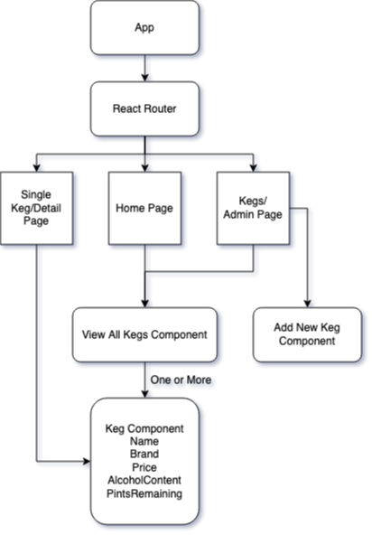

# Viking Tap Room

Administer Kegs at the Viking Tap Room! Create, Read, Update, Delete Kegs via React+Redux. See keg status including name, price, pints remaining, and alcohol content.

For a production build of this application, please visit [http://viking_tap_room.surge.sh/](http://viking_tap_room.surge.sh/)

---

### Instructions

1. Clone this repository via `git clone https://github.com/Usarneme/Viking_Tap_Room_Redux`
2. Enter the new directory and project folder `cd Viking_Tap_Room_Redux/client`
3. Install dependencies `npm install`
4. Start the server `npm run start`
5. Navigate to localhost:3000/ in your browser of choice

---

### Dependencies/Tech Stack

- NodeJS
- React
- Redux
- Jest Tests
- PropTypes
- ReactIcons
- CreateReactApp

---

### Testing

All Redux reducers are fully tested.
To run the test suite, enter the project directory with `cd client/` and run `npm run test`

---

### React Pages and Components Diagram

---

### Known Issues/Bugs

1. None at this time! Please submit a pull request if any are found. Thanks

---

### User Stories

- As a user, I want to see a list/menu of all available kegs. For each keg, I want to see its name, brand, price and alcoholContent (or perhaps something like flavor for a kombucha store).
- As a user, I want to submit a form to add a new keg to a list.
- As a user, I want to be able to click on a keg to see its detail page.
- As a user, I want to see how many pints are left in a keg. Hint: A full keg has roughly 124 pints.
- As a user, I want to be able to click a button next to a keg whenever I sell a pint of it. This should decrease the number of pints left by 1. Pints should not be able to go below 0.

---

### License

GPLv3

---

### Copyright

&copy; 2021 Tom/Usarneme

---

### Contributions/Attribution

- Thanks to [Meyerweb](https://meyerweb.com/eric/tools/css/reset/) for the CSS Reset
- Thanks to Shirley Two Feathers' [Pagan Calendar](https://shirleytwofeathers.com/The_Blog/pagancalendar/category/norse-and-viking-festivals/) and [Vikingpedia](https://en.vikidia.org/wiki/List_of_Norse_gods_and_goddesses) for inspiration for the theme of this project.
